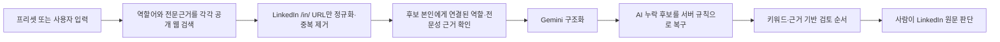

# Direct X-ray Searching

공개 웹에 색인된 LinkedIn 프로필을 여러 직무 키워드로 찾아 하나의 후보 풀로 합치고, **왜 이 사람을 직접 확인해 볼 가치가 있는지** 공개 근거와 함께 보여주는 다이렉트 소싱 도구입니다.

> AI가 사람을 뽑거나 탈락시키는 서비스가 아닙니다. AI 점수는 공개 근거를 읽기 편한 순서로 정리하는 참고값이며, 최종 판단은 반드시 사람이 LinkedIn 원문과 인터뷰에서 해야 합니다.

- 직접 돌려보기: [내 컴퓨터에서 실행해 보기](#내-컴퓨터에서-실행해-보기) - Node.js와 본인 API 키만 있으면 됩니다
- 상세 검색 품질 기록: [Retrieval quality log](docs/retrieval-quality.md)
- 현재 검증 상태: 자동 테스트 통과, 새 심층 검색 전략의 실제 운영 검색 비교는 배포 후 진행 예정

**공개 데모는 두지 않습니다.** 이 도구는 업무 환경에서 쓰려고 만든 것이라 운영 주소를 공개하지 않습니다. 대신 코드와 설계를 전부 공개하고, 써 보려는 사람은 각자 자기 컴퓨터에서 자기 API 키로 띄우는 방식(BYOK)입니다. 제 키를 빌려 쓰는 구조가 아니므로 사용량도, 검색 기록도 본인 것으로 남습니다.

### 코드보다 먼저 봐 주셨으면 하는 것

이 저장소에서 제가 보여드리고 싶은 것은 "검색이 된다"가 아닙니다. **무엇을 근거로 인정했고 무엇을 인정하지 않았는지, 그리고 안 될 때 그것을 어떻게 기록했는지**입니다.

- [검색 품질 기록](docs/retrieval-quality.md) - 기준 후보 10명 중 **0명을 찾아낸 실패**를 그대로 적어두고, 병목이 AI 평가가 아니라 검색 공급자 단계임을 단계별 수치로 규명한 기록입니다. 개선 여부를 판정할 기준과 기각 조건을 미리 선언해 뒀습니다.
- [점수는 무엇이고 무엇이 아닌가](#점수는-무엇이고-무엇이-아닌가) - AWS 자격증과 클라우드 통제 책임, ISMS 심사원과 인증 범위 책임, 센터장 직함과 실제 조직 운영 권한을 각각 다른 것으로 취급합니다. 채용에서 이 셋을 섞으면 사람을 잘못 봅니다.
- [공개 프로필 범위와 개인정보 원칙](#공개-프로필-범위와-개인정보-원칙) - 나이, 성별, 국적, 혼인, 건강을 검색어·추론·점수·필터 어디에도 쓰지 않도록 코드에 차단 규칙을 넣었습니다. 이름이나 근무지로 국적을 추정하지도 않습니다.
- `scripts/test-worker.mjs` - "물리보안 문맥만 있는 Security Director는 제외한다" 같은 판별 기준을 테스트로 고정해 뒀습니다.

## 30초 요약

채용담당자가 `CPO`, `CISO`, `개인정보보호책임자`처럼 서로 다른 역할 키워드를 입력하면 다음 작업을 한 번에 수행합니다.

1. 키워드를 하나씩 독립적으로 공개 웹에서 검색합니다.
2. LinkedIn 개인 프로필(`/in/`)만 남기고 같은 사람의 URL을 합칩니다.
3. 직함뿐 아니라 책임, 성과, 인증, 클라우드, 거버넌스 같은 공개 근거도 확인합니다.
4. Gemini가 내용을 구조화하고, AI가 놓친 근거 후보는 서버 규칙으로 다시 보존합니다.
5. 점수가 높은 순으로 보여주되 낮은 점수의 후보도 검토 풀에서 자동 탈락시키지 않습니다.
6. 각 카드에 점수를 만든 키워드와 공개 원문 일부를 표시합니다.

현재 기본 프리셋은 CPO 채용 실험용이지만, 제품 이름이 CPO 검색기가 아닌 **Direct X-ray Searching**인 이유는 다른 직무도 독립 프리셋으로 추가할 수 있도록 설계했기 때문입니다.

## 왜 만들었나

다이렉트 소싱을 할 때 리멤버나 원티드는 후보를 알아서 정리해 줍니다. AI 기능도 플랫폼 안에 들어 있어서 따로 만들 것이 없습니다.

문제는 그 안에 없는 사람들이었습니다. C레벨처럼 경력이 긴 인력이나 외국계에서 일해 온 인력은 국내 플랫폼보다 LinkedIn에 몰려 있습니다. 그런데 LinkedIn에서는 같은 방식이 안 됩니다. 정리해 주는 기능도, 붙어 있는 AI도 없습니다. 검색창에 키워드를 바꿔 넣어가며 사람이 하나씩 훑는 수밖에 없었습니다.

방법을 찾다가 X-ray searching을 알게 됐습니다. 검색엔진에 색인된 공개 프로필을 직접 찾아내는 방식입니다. 다만 손으로 하면 키워드마다 검색을 새로 돌리고, 같은 사람이 여러 번 나오는 것을 눈으로 걸러야 합니다. 그 반복을 도구로 옮긴 것이 이 프로젝트입니다.

저는 개발자가 아닙니다. HR 실무에서 막힌 지점을 AI를 써서 직접 풀어본 결과물이고, 이 저장소는 그 과정과 판단을 남겨둔 기록입니다.

### 도구가 지키려 한 경계

일반 검색은 결과가 많지만 “왜 확인해야 하는 사람인지”를 한눈에 알기 어렵습니다. 반대로 AI 추천은 모델이 구조화하지 못한 후보가 아예 사라지거나, 설명 없는 점수가 합격 가능성처럼 보이기 쉽습니다.

이 프로젝트는 검색과 채용 판단의 경계를 분명하게 나눕니다.

- 검색 엔진은 공개 후보를 넓게 찾습니다.
- 서버는 URL 중복을 제거하고 후보별 발견 경로를 합칩니다.
- AI는 공개 근거를 구조화하고 검토 순서를 정리합니다.
- 사람은 표시된 키워드와 LinkedIn 원문을 보고 실제 적합성을 판단합니다.

핵심 목표는 “AI가 가장 적합한 사람을 정답처럼 고르는 것”이 아니라, **놓치기 쉬운 후보까지 넓게 모으고 사람이 판단할 근거를 투명하게 제공하는 것**입니다.

## 내 컴퓨터에서 실행해 보기

서버에 올리지 않고 본인 컴퓨터에서 바로 띄울 수 있습니다. 개발 지식은 필요 없고, 명령어 한 줄이면 됩니다.

**1. Node.js를 설치합니다.** [nodejs.org](https://nodejs.org)에서 LTS 버전을 받아 설치하면 됩니다.

**2. 이 저장소를 내려받습니다.** 위쪽 초록색 `Code` 버튼 > `Download ZIP`으로 받아 압축을 풀면 됩니다.

**3. 그 폴더에서 명령창을 열고 다음을 실행합니다.**

```bash
node scripts/preview.mjs
```

**4. 브라우저에서 `http://127.0.0.1:4179`을 엽니다.**

> API 키 없이 화면만 둘러보려면 `node scripts/demo.mjs`(→ `127.0.0.1:4180`)를 쓰세요.
> 검색 응답을 가상 후보로 갈아끼운 채 앱 자체는 그대로 돌립니다. 검색 파이프라인,
> 근거 등급, 점수 산출, 카드 렌더는 전부 실제 코드가 수행합니다. 네트워크를 타지 않으니
> 크레딧도 들지 않고, 실존 인물의 프로필이 화면에 뜨지도 않습니다.

**5. 화면에서 본인의 API 키 두 개를 입력합니다.**

| 키 | 발급처 | 하는 일 |
|---|---|---|
| Tavily | [tavily.com](https://tavily.com) | 공개 웹에서 프로필을 찾아옵니다 |
| Gemini | [Google AI Studio](https://aistudio.google.com) | 찾아온 내용을 후보 카드로 정리합니다 |

두 서비스 모두 무료 사용량이 있어 시험해 보는 데는 결제가 필요하지 않습니다. 실제 한도와 요금제는 각 서비스에서 확인하세요.

### 알아둘 것

- **키는 본인 컴퓨터 밖으로 나가지 않습니다.** 로컬 실행은 메모리 안의 임시 저장소를 쓰기 때문에, 프로그램을 끄면 입력한 키도 검색 결과도 함께 사라집니다.
- 검색 요청은 브라우저가 아니라 본인 컴퓨터에서 도는 서버가 보냅니다. 키가 화면 소스에 노출되지 않습니다.
- 사용량과 비용은 본인 계정에 붙습니다. 제 계정을 거치지 않습니다.
- 상시로 두고 쓰려면 `npm run build`로 만든 `dist/`를 OpenAI Sites에 올리면 됩니다. 그때는 `CPO_ALLOWED_HOST`(서비스 주소), `BYOK_MASTER_KEY`(키 암호화용), `CPO_OWNER_EMAIL_HASH`(소유자 식별)를 배포 환경변수로 넣어야 합니다. 저는 회사 업무 환경에서 이 방식으로 돌렸습니다.

## 비개발자를 위한 사용 방법

### 1. 반복 채용 프리셋을 선택합니다

프리셋에는 그 직무에 맞는 기본 역할어, 평가 신호, 전문근거 검색면이 들어 있습니다. 현재 제공하는 CPO 프리셋은 개인정보보호·정보보호 리더 채용을 위한 테스트베드입니다.

프리셋에 없는 직무는 커스텀 입력으로 검색할 수 있습니다. 커스텀 검색은 사용자가 입력한 역할어와 업무 문맥만 사용하며 CPO 전용 지식을 몰래 가져다 쓰지 않습니다.

### 2. 검색 조건을 확인합니다

- **직무**: 찾고 싶은 포지션의 설명입니다.
- **대상 시장·근무 조건**: 검색할 업무 시장과 문맥입니다.
- **검색 키워드**: 한 줄에 하나씩, 최대 5개를 입력합니다. 각 줄은 서로 섞지 않고 독립 검색합니다.
- **필수 조건**: 후보를 찾는 검색어가 아니라 마지막 AI 평가에 참고하는 조건입니다.
- **우대 조건**: 있으면 좋은 경험이나 역량입니다.
- **평가 참고**: 특수한 사업·조직 문맥처럼 평가 때 함께 볼 설명입니다.

CPO 프리셋의 “한국 관련 인재”는 **한국에 현재 거주하는 사람**이나 **한국 국적자**를 뜻하지 않습니다. 한국 사업, 한국 규제, PIPA·ISMS-P, 한국 법인·시장 책임처럼 공개된 직무 관련성을 찾는다는 뜻입니다. 이름과 위치만으로 국적·시민권·민족을 추론하지 않습니다.

### 3. `키워드별 후보 찾기`를 누릅니다

검색 중에는 공급자용 긴 실행어를 노출하지 않고 진행 단계만 보여줍니다. 키워드 5개 기준으로 다음 두 종류의 검색을 합칩니다.

- 정확한 역할어 검색 5회
- 프리셋이 정의한 전문근거 검색 5회

초기 검색은 Tavily `basic` 검색 10회, 최대 10 credits를 사용합니다. 결과는 URL 기준으로 중복 제거됩니다.

### 4. 후보 카드에서 “왜 볼 사람인지” 확인합니다

점수만 보지 말고 다음 세 가지를 함께 보세요.

1. 어떤 역할어 또는 전문근거 검색에서 발견됐는가
2. 어떤 키워드가 몇 점을 만들었는가
3. 그 키워드가 후보 본인의 공개 경력 문장에 실제로 연결되어 있는가

원문이 모호하거나 정보가 없으면 탈락이 아니라 `VERIFY`로 표시합니다. 공개 프로필에 쓰지 않았다는 사실과 실제 경험이 없다는 사실은 다르기 때문입니다.

### 5. 풀이 부족하면 `심층 검색으로 더 찾기`를 누릅니다

심층 검색은 초기 검색을 똑같이 반복하지 않습니다. 프리셋이 별도로 정의한 5개의 확장 관점으로 Tavily `advanced` 검색을 실행합니다. CPO 프리셋은 다음 유형을 추가로 탐색합니다.

- 최고책임자·임원 총괄 직함의 다른 표현
- 금융·핀테크·소비자 기업의 보안 부문장·센터장
- 전직 CPO/CISO 경력이 있는 클라우드·보안 아키텍트
- ISMS-P 선임심사, 국제표준, 인증 리더십
- Privacy 법률·전문 커뮤니티·AI 거버넌스 리더십

키워드 5개 기준으로 심층 검색도 최대 10 credits를 사용합니다. 새 결과는 현재 탭의 기존 풀과 합쳐지고, 같은 LinkedIn URL은 한 사람으로 유지됩니다. 처음 검색과 심층 검색에서 각각 발견된 경로는 모두 카드에 남습니다.

### 6. 검토가 끝나면 후보 풀을 비웁니다

`후보 풀 비우기`는 현재 브라우저 탭의 후보를 지웁니다. 자동 검색 결과는 앱 서버에 후보 데이터베이스로 영구 저장하지 않습니다. 새로 확인하려면 풀을 비우거나 페이지를 새로 열어 다시 검색합니다.

## 후보 카드 읽는 법

| 표시 | 의미 | 사람이 할 일 |
|---|---|---|
| 우선검토 점수 | 공개 원문에서 확인된 신호의 가중 합계 | 합격 확률로 해석하지 말고 검토 순서에만 사용 |
| `direct` | CPO, CISO 등 목표 역할군 직함이 본인 프로필에 직접 확인됨 | 현재·과거 직함과 실제 권한 범위 확인 |
| `adjacent` | 개인정보·정보보호 책임이나 성과가 본인 경력에 연결됨 | 목표 직함 없이도 역할을 수행했는지 확인 |
| `expanded` | 직함은 불명확하지만 장기 경력·복수 전문근거 또는 공식 전문 커뮤니티 리더십이 확인됨 | 가장 먼저 사실관계를 검증; 점수는 49점 이하 |
| Coverage High/Medium/Low | 공개 근거가 평가 영역을 얼마나 덮는지 나타냄 | 낮다고 탈락시키지 말고 정보 부족 여부 확인 |
| `VERIFY` | 공개 정보만으로 확정할 수 없음 | LinkedIn 원문, 이력서, 인터뷰로 확인 |
| 책임·성과 근거 | 후보가 직접 운영·총괄·개선한 범위와 결과 | 가장 강한 근거로 참고 |
| 공식 제3자 지정 | 전문기관이 후보의 역할을 이름과 함께 공식적으로 명시 | 후보 본인 서술과 구분해 원문 확인 |
| 자격·심사원 단서 | 관련 자격 또는 심사원 표기는 있으나 기업 책임은 불명확 | 자격 보유와 실무 총괄을 동일시하지 않음 |
| 직함·용어 단서 | 관련 단어는 있으나 실제 책임·결과가 불명확 | 낮은 참고 신호로만 사용 |

예를 들어 `AWS` 자격만으로 클라우드 보안 운영 경험을 확정하지 않습니다. IAM, 로그, 암호화, 리전, 백업, 사고대응 같은 책임 문장이 함께 있는지 봅니다. `ISMS-P 심사원`도 기업 내부 인증 총괄 경험과 구분하고, `Director` 또는 `센터장` 직함도 채용·평가·예산·조직 설계 근거와 따로 봅니다.

## 점수는 무엇이고 무엇이 아닌가

점수는 공개 원문에서 확인된 신호를 사람이 빠르게 검토하도록 정렬한 값입니다.

점수에 활용하는 대표 신호는 다음과 같습니다.

- CPO/CISO 또는 이에 준하는 개인정보·정보보호 책임
- 개인정보 프로그램과 Privacy by Design
- AWS 등 클라우드 보안 거버넌스
- ISMS/ISMS-P 인증·심사 대응
- 사고·규제기관 대응
- 조직 리딩과 임원 보고
- 플랫폼·데이터 환경 경험
- 보안·개인정보 관련 자격

점수는 다음을 의미하지 않습니다.

- 채용 적합도 또는 합격 확률
- 실제 재직 여부의 보증
- 필수 조건을 모두 충족했다는 판정
- 후보의 인성, 문화 적합성, 리더십 품질에 대한 결론
- 공개 프로필에 없는 경력의 부재

따라서 낮은 점수도 후보 삭제 사유가 아닙니다. AI는 키워드와 공개 문장을 기준으로만 판단하므로, 사람이 보면 중요한 맥락을 놓칠 수 있습니다. 이 도구는 그런 후보를 풀에 남겨 사람이 다시 보게 하는 쪽을 선택합니다.

## 검색이 작동하는 방식



### 초기 검색: 폭을 확보하는 단계

정확한 직함만 찾으면 유사한 책임을 수행했지만 프로필 제목에 CPO를 쓰지 않은 사람을 놓칩니다. 반대로 전문 용어만 넓게 찾으면 자격증, 공유 글, 채용공고가 섞입니다. 그래서 초기 검색은 역할어 검색과 전문근거 검색을 나눠 동시에 사용합니다.

### 심층 검색: 다른 표현을 추가하는 단계

검색 공급자는 같은 개념도 표현에 따라 전혀 다른 결과를 반환합니다. 심층 검색은 초기 쿼리를 더 세게 반복하는 방식이 아니라, 레퍼런스 후보에서 반복해서 관찰된 직무 유형을 개인 이름 없이 일반화한 별도 검색면을 사용합니다.

### AI 누락 후보 복구

Gemini가 모든 검색 결과를 완벽하게 JSON으로 구조화한다는 보장은 없습니다. 공개 원문에 후보 본인과 역할 근거가 결속되어 있다면 서버가 누락된 후보를 검토 풀로 복구합니다. 즉, AI 출력이 후보 풀 가입을 결정하는 유일한 문이 아닙니다.

### 프리셋 확장

프리셋은 단순한 입력값 묶음이 아니라 직무별 검색·평가 정책입니다. 새 프리셋에는 다음 요소를 각각 정의할 수 있습니다.

- 화면에 보여 줄 직무·시장·키워드 기본값
- 동음이의 역할어를 구분하는 짧은 identity context
- 초기 전문근거 검색면
- 심층 확장 전문근거 검색면
- 점수에 사용할 직무별 평가 신호

프리셋을 추가하지 않은 커스텀 직무는 입력한 정확 역할어에 결속된 일반 검색을 사용합니다. 이 격리는 자동 테스트로 확인합니다.

## 공개 링크와 API 키

> 아래는 이 도구를 서버에 올려 여러 사람이 쓰게 할 때의 동작입니다. **제가 운영하는 공개 링크는 없습니다.** 직접 써 보실 때는 앞의 [내 컴퓨터에서 실행해 보기](#내-컴퓨터에서-실행해-보기)를 따라 본인 키로 띄우시면 됩니다.

운영자가 사이트 설정에서 Tavily와 Gemini API 키를 한 번 저장하고 공개 검색을 켜면, **링크를 아는 방문자는 자신의 키를 입력하지 않고 검색할 수 있습니다.** 방문자의 요청은 서버에 저장된 운영자 키로 실행되므로 API 사용량과 비용은 운영자 계정에 귀속됩니다.

키 보안은 다음처럼 동작합니다.

- API 키는 브라우저 HTML이나 GitHub 저장소에 넣지 않습니다.
- 키는 서버에서 AES-GCM 방식으로 암호화되어 D1 호환 저장소에 보관됩니다.
- 암호화 마스터 키는 배포 환경변수로만 관리합니다.
- 일반 방문자와 검토자는 저장된 키 값을 조회·수정·삭제할 수 없습니다.
- 실제 Tavily·Gemini 호출은 브라우저가 아니라 서버에서 수행합니다.

공개 링크라고 해서 무제한 사용되는 것은 아닙니다. 기본값 기준으로 다음 안전장치가 있습니다.

- 공개 방문자별 Tavily 일일 20 credits
- 공개 사이트 전체 Tavily 일일 200 credits
- 소유자 Tavily 일일 200 credits
- 같은 사용자·같은 조건·같은 검색 라운드는 완료 후 15분간 중복 실행 방지
- 검색은 버튼을 눌렀을 때만 실행

한도는 배포 환경에서 변경할 수 있습니다. 공개 링크를 공유하면 다른 사람도 운영자 API 한도 안에서 검색할 수 있으므로, 사용량과 공급자 요금제는 운영자가 확인해야 합니다.

## 공개 프로필 범위와 개인정보 원칙

- 공개 검색엔진에 색인된 LinkedIn 개인 프로필(`/in/`)만 대상으로 합니다.
- LinkedIn 로그인을 대신하거나, 비공개 프로필을 열거나, LinkedIn을 직접 자동 크롤링하지 않습니다.
- 검색엔진에 노출되지 않은 프로필은 찾을 수 없습니다.
- 연락처와 민감정보 패턴은 후보 텍스트에서 제거합니다.
- 검색 원문에 포함된 prompt-injection 문장은 Gemini 전달 전에 차단합니다.
- 연령, 출생연도, 졸업연도는 검색·추론·점수·필터에 사용하지 않습니다.
- 이름이나 위치로 국적, 시민권, 민족을 추론하지 않습니다.
- 자동 검색 후보는 서버에 영구 저장하지 않습니다.

Gemini 또는 Tavily 같은 외부 API에는 공개 검색어와 공개 프로필 일부가 처리될 수 있습니다. 비공개 이력서, 연락처, ATS 정보, 내부 평가 메모는 입력하지 마세요.

## 결과가 없거나 이상할 때

### `no_candidates`

검색 공급자가 결과를 반환했더라도 LinkedIn 개인 프로필이 아니거나, 후보 본인에게 역할·전문성 근거가 연결되지 않으면 카드가 없을 수 있습니다. 키워드를 더 일반화하거나 인접 직함을 한 줄씩 추가한 뒤 다시 검색해 보세요.

### 관련 없는 해외 후보가 보일 때

현재 거주지는 필터가 아닙니다. 다만 한국 사업·규제·시장 관련 공개 근거가 있어야 CPO 프리셋의 한국 관련 후보로 분류됩니다. 위치나 이름만으로 한국인이라고 추론하지 않습니다.

### 점수가 예상과 다를 때

점수 상세의 키워드와 excerpt를 먼저 확인하세요. AI가 이해한 공개 문장과 실제 직무 맥락이 다를 수 있습니다. 점수는 사람이 원문을 볼 순서이지 판단의 결론이 아닙니다.

### Gemini 오류가 날 때

모델명·API 버전·구조화 응답 조합이 공급자에서 지원되는지, 키와 할당량이 유효한지 확인해야 합니다. 서버는 지원 모델과 API 버전 후보를 순차 시도하고, 검색 근거가 유효하면 AI 구조화 누락 후보를 복구하도록 설계되어 있습니다.

### 같은 검색이 바로 다시 실행되지 않을 때

완료된 동일 검색의 실수 재실행과 API 비용 중복을 막기 위해 같은 라운드는 기본 15분 동안 차단됩니다. 초기 검색과 심층 검색은 서로 다른 라운드이므로 각각 한 번 실행할 수 있습니다.

## 검색 품질을 판단하는 기준

후보 수가 늘었다고 검색이 좋아졌다고 결론 내리지 않습니다. 다음 지표를 함께 봅니다.

- 비공개 기준 후보 URL을 실제로 다시 찾았는가
- 검색에서 확인된 근거 후보가 최종 카드까지 보존됐는가
- 직함, 자격, 공유 글을 실제 역할로 잘못 읽지 않았는가
- 새로 발견된 후보 중 사람이 원문을 확인할 가치가 있는 비율은 얼마인가
- 한 검색 키워드가 전체 풀을 독점하지 않는가
- 초기·심층 검색의 API credits와 응답시간이 운영 가능한가

기준 후보는 이름과 URL을 Git에 올리지 않고, 매 요청마다 달라지는 일회성 해시로 `raw URL → 역할 결속 → 검토 풀 → 최종 카드` 중 어디에서 사라졌는지만 측정합니다.

## 현재 상태와 한계

2026-08-12 운영 배포본의 기준선은 다음과 같습니다.

```text
Tavily raw 100
→ URL 중복 제거 77
→ 역할 근거가 연결된 검토 카드 37
→ 소스에서 카드까지 보존 37/37
→ 비공개 기준 후보 URL 재현 0/10
```

이 결과는 AI 구조화 이후 후보 보존은 개선됐지만, 검색 공급자 단계에서 기준 프로필을 찾는 문제가 남았다는 뜻입니다. 이번 버전은 초기 검색과 겹치지 않는 심층 확장 검색면을 추가했고, 레퍼런스에서 관찰된 다섯 직무 유형이 자동 fixture에서 모두 카드로 보존되는 것을 확인했습니다.

다만 **자동 fixture 통과는 실제 검색 정확도 향상의 증명이 아닙니다.** 머지 후 운영 배포본에서 같은 비공개 기준 URL로 다시 검색해 `0/10`보다 개선되는지 확인해야 합니다. 기준 재현율이 오르지 않으면 현재 검색 전략을 수정하거나 기각합니다.

그 밖의 현실적인 한계도 있습니다.

- 공개 검색엔진의 색인 상태와 순위에 따라 결과가 달라집니다.
- LinkedIn 원문이 짧거나 검색 snippet이 잘리면 근거가 부족할 수 있습니다.
- AI는 공개 문장 밖의 실제 성과와 조직 맥락을 알 수 없습니다.
- 현재 재직 상태, 법정 선임 요건, hard gate는 사람이 별도로 검증해야 합니다.
- 검색 결과는 특정 시점의 공개 웹 스냅샷이며 최신성을 보증하지 않습니다.

## 개발자·포트폴리오 관점의 설계 포인트

- JavaScript ESM Worker 하나에 API와 dependency-light 웹 UI를 구성했습니다.
- Tavily 검색과 Gemini 구조화를 분리하고, 공급자 오류를 사용자에게 구조화된 상태로 전달합니다.
- 후보 membership과 점수 정렬을 분리해 낮은 점수 후보도 보존합니다.
- URL 정규화, 검색면 균형 선발, 초기·심층 합집합으로 recall을 관리합니다.
- API 키 AES-GCM 암호화, 역할별 권한, 공개 사용자 해시, 일일 credit 제한, 중복 실행 방지를 포함합니다.
- 실제 후보 URL을 공개하지 않는 privacy-safe retrieval benchmark를 제공합니다.
- CPO 전용 지식과 커스텀 직무를 격리해 다른 역할 프리셋으로 확장할 수 있습니다.

## 기술 구성

- JavaScript ESM Worker
- Tavily Search API
- Gemini structured output와 검증된 서버 fallback
- 암호화된 BYOK 설정과 사용량 통제를 위한 D1 호환 저장소
- OpenAI Sites 배포 아티팩트
- 별도 프레임워크 의존성을 최소화한 HTML·CSS·브라우저 JavaScript UI

## 저장소 구조

```text
worker/index.js
  Worker API, 검색·평가·보안 로직, 웹 UI

db/schema.ts
  D1 저장소 스키마

scripts/test-worker.mjs
  검색·평가·인증·사용량·안전성 end-to-end 계약 테스트

scripts/benchmark-retrieval.mjs
  비공개 레퍼런스 recall과 후보 풀 보존 benchmark

scripts/build.mjs
  배포용 단일 아티팩트 생성

scripts/validate-artifact.mjs
  생성된 아티팩트의 구조와 실행 가능성 검증

dist/server/index.js
  검증된 Sites 배포 아티팩트

docs/retrieval-quality.md
  검색 실험, 기준선, live 합격·기각 기준
```

## 로컬 검증

Node.js가 설치된 환경에서 저장소 폴더를 열고 다음 명령을 실행합니다.

```bash
npm test
npm run build
npm run validate
node scripts/preview.mjs
```

기본 preview 주소는 `http://127.0.0.1:4179`입니다. 로컬 preview는 모의 D1 저장소를 사용하며 실제 Tavily·Gemini 키나 운영 환경값을 저장소에 포함하지 않습니다.

검증 범위에는 다음 항목이 포함됩니다.

- 역할어 검색과 전문근거 검색의 독립 실행
- 초기·심층 검색 query와 credit 예산
- URL 중복 제거와 후보 풀 합집합
- Gemini 누락 후보의 서버 복구
- CPO 프리셋과 커스텀 역할의 지식 격리
- 역할·자격·공유 글 오인 방지
- 한국 직무 관련성과 거주지·국적 추론의 분리
- 소유자·검토자·공개 방문자 권한
- 공개 방문자와 사이트 전체 사용량 제한
- API 키 암호화 저장·삭제
- 후보·연락처·비밀정보의 저장소 유출 방지

## 운영 전 체크리스트

- [ ] 운영자 Tavily·Gemini 키가 서버 설정에 암호화 저장됐는가
- [ ] 암호화 마스터 키와 공개 사용자 salt가 배포 환경변수에만 있는가
- [ ] 공개 검색 기능과 방문자·사이트 전체 일일 한도가 의도한 값인가
- [ ] 배포본에서 첫 검색과 심층 검색이 각각 정상 완료되는가
- [ ] 후보 카드에 키워드, 배점, excerpt, 원문 링크가 표시되는가
- [ ] 비공개 기준 URL benchmark가 이름·URL 노출 없이 실행되는가
- [ ] 실제 채용 판단자가 `VERIFY`와 점수의 의미를 이해했는가

## 프로젝트 원칙

1. 공개정보가 없으면 `FAIL`이 아니라 `VERIFY`입니다.
2. 점수는 합격 확률이 아니라 검토 순서입니다.
3. AI가 구조화하지 못했다는 이유로 근거 후보를 버리지 않습니다.
4. 직함·자격·용어와 실제 책임·성과를 구분합니다.
5. 한국 관련성은 직무 근거로 판단하며 거주지·이름으로 국적을 추론하지 않습니다.
6. 낮은 점수의 후보도 사람이 확인할 수 있게 남깁니다.
7. 후보 수가 아니라 기준 후보 재현율과 오인율로 검색 개선을 판정합니다.
8. 최종 채용 판단은 언제나 사람에게 있습니다.
