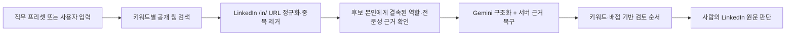

# Direct X-ray Searching

공개 웹에 색인된 LinkedIn 프로필을 직무 키워드별로 탐색하고, **왜 이 사람을 확인할 가치가 있는지** 근거 키워드와 함께 보여주는 human-in-the-loop 소싱 도구입니다.

> AI는 후보를 탈락시키는 심사관이 아니라 검토 순서를 정리하는 보조자입니다. 점수는 합격 확률이 아니며, 공개정보 미기재는 `FAIL`이 아니라 `VERIFY`입니다.

[Live demo](https://)

## Why this project

일반적인 AI 후보 추천은 모델이 구조화하지 못한 사람을 결과에서 없애거나, 하나의 점수를 적합도처럼 보여주기 쉽습니다. Direct X-ray Searching은 검색 결과와 사람의 판단 사이를 다음 원칙으로 연결합니다.

- 한 줄에 하나의 역할 키워드를 독립 검색합니다.
- 검색 결과를 URL 기준으로 합집합·중복 제거합니다.
- 근거가 결속된 후보는 AI가 누락해도 검토 풀에 보존합니다.
- 점수와 함께 정확한 키워드, 배점, 공개 excerpt를 표시합니다.
- 직접 직함 근거와 인접 전문성 근거를 구분합니다.
- 낮은 점수도 사람이 원문을 확인할 수 있게 남깁니다.

## Search flow



검색 중에는 공급자 실행어를 길게 노출하지 않고 진행 상태만 보여줍니다. 완료 후 후보 카드에서 확인해야 할 이유, 직접/인접 역할 근거, 키워드별 배점과 원문 링크를 제공합니다.

## Core behavior

- **Extensible presets**: 현재 CPO 테스트 프리셋은 역할어와 검증된 전문근거 검색면을 함께 소유합니다. 다른 역할은 자기 역할어·평가 신호·전문근거 검색면을 별도 프리셋으로 추가할 수 있으며, 커스텀 검색에는 CPO 지식을 임의로 적용하지 않습니다.
- **Role + evidence retrieval**: 정확한 역할어 검색 5회와 프리셋 전문근거 검색 5회를 같은 10 credits 안에서 합칩니다. CPO 프리셋은 개인정보 거버넌스, ISMS-P 성과, 클라우드 보안, 사고·규제 대응, Privacy by Design·PIA 책임을 각각 탐색합니다.
- **Evidence-preserving pool**: Gemini 출력이 후보 풀의 membership gate가 되지 않습니다. 구조화 실패 시 서버가 검색 원문에 결속된 후보를 복구합니다.
- **Direct vs. adjacent evidence**: 실제 CPO/CISO 직함과 개인정보·보안 책임·성과가 후보 본인에게 결속된 인접 후보를 별도로 표시합니다. 자격증 보유나 관심 주제만으로는 인접 후보가 되지 않습니다.
- **Truthful discovery labels**: 카드에는 실제로 발견된 `전문근거 · …` 경로와 프로필 원문에서 확인된 역할어를 분리해 표시합니다. 전문근거 검색으로 찾은 사람을 CPO 키워드 검색 결과로 오표기하지 않습니다.
- **Context-aware role matching**: `CISO-CQ 자격`, 기사 주제, 좋아요·공유 활동을 현재 직함으로 오인하지 않습니다.
- **Korea professional relevance**: 한국 업무·규제·시장 근거를 보되 현재 거주지는 필터링하지 않고, 이름이나 위치로 국적·시민권을 추론하지 않습니다.
- **Ephemeral search**: 자동 검색 후보는 서버에 영구 저장하지 않습니다.

## Candidate score

점수는 채용 적합도나 합격 가능성이 아니라 공개 원문에서 확인된 신호의 합계입니다. 예를 들어 다음과 같은 신호가 검토 순서에 사용됩니다.

- CPO/CISO 또는 이에 준하는 개인정보·정보보호 책임
- 개인정보 프로그램과 Privacy by Design
- AWS 등 클라우드 보안 거버넌스
- ISMS/ISMS-P 심사 대응
- 사고·규제기관 대응
- 조직 리딩
- 플랫폼·데이터 환경 경험
- 보안·개인정보 관련 자격

모든 hard gate와 실제 재직 상태는 LinkedIn 원문 및 인터뷰에서 사람이 검증해야 합니다.

## Privacy and security

- 공개 검색엔진에 색인된 LinkedIn `/in/` 프로필만 대상으로 하며 LinkedIn 계정 자동화나 직접 크롤링을 하지 않습니다.
- 연락처와 민감 패턴을 제거하고, 검색 원문의 prompt-injection 문장을 Gemini 전달 전에 제외합니다.
- Tavily·Gemini 키는 브라우저나 Git 저장소에 포함하지 않고 서버에서 암호화해 보관합니다.
- 공개 방문자별·사이트 전체 일일 credit 한도를 적용합니다.
- 연령, 출생연도, 졸업연도는 검색·추론·점수·필터에 사용하지 않습니다.

## Tech stack

- JavaScript ESM Worker
- Tavily Search API
- Gemini structured output with validated fallback
- D1-compatible storage for encrypted BYOK configuration and usage controls
- OpenAI Sites deployment
- Dependency-light HTML, CSS and browser JavaScript UI

## Local validation

```bash
npm test
npm run build
npm run validate
npm run preview
```

로컬 preview는 기본적으로 모의 D1 저장소를 사용합니다. 실제 Tavily·Gemini 키나 운영 환경값은 저장소에 포함되지 않습니다.

## Repository structure

```text
worker/index.js             Worker API and embedded web UI
db/schema.ts                D1 schema
scripts/test-worker.mjs     end-to-end contract and safety tests
scripts/benchmark-retrieval.mjs private-reference recall and pool-preservation benchmark
scripts/build.mjs           deployable artifact build
scripts/validate-artifact.mjs
dist/server/index.js        validated Sites deployment artifact
docs/retrieval-quality.md   retrieval experiments and live acceptance criteria
```

## Current validation status

- Worker 계약·인증·공개 사용량 제한·검색 병합·구조화 fallback·안전성 테스트 통과
- 회귀 fixture에서 직접 CPO/CISO 직함이 없어도 개인정보 거버넌스 책임과 ISMS-P 성과가 결속된 리더를 보존하고, 자격증·관심사만 있는 프로필은 제외
- 마지막 live 비교에서 검토 카드가 `15명`에서 `49명`으로 확대
- 검색 근거가 있는 소스의 카드 보존율이 `15/34`에서 `49/49`로 개선
- 기준 후보 10명의 URL 재현율은 아직 `0/10`; 검색 공급자 색인 차이를 줄이는 retrieval 실험이 남아 있음

후보 수가 늘어난 것을 검색 정확도 향상으로 단정하지 않습니다. 다음 평가는 기준 후보 재현율, 신규 유효 후보 비율, 역할 오인율을 함께 비교해야 합니다.

실험 설계와 판정 기준은 [retrieval quality log](docs/retrieval-quality.md)에 기록합니다.
